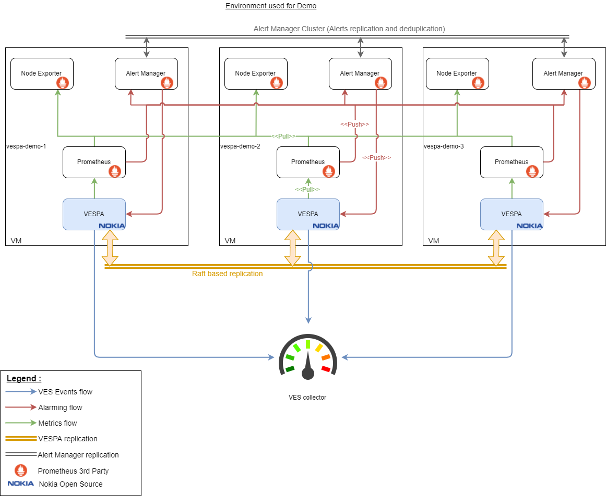

# Configuration example

This folder holds a basic example of how to configure **VESPA** and **Prometheus** with **Node Exporter** and **AlertManager**.

The example environment has 3 Virtual Machines (vespa-demo-1, vespa-demo-2 and vespa-demo-3) which can be seen as VNFC instances belonging to the same VNF named vespa-demo.
4 processes are installed on them:

* **Node Exporter** is responsible from collecting and exposing OS metrics to Prometheus
* **Prometheus** periodically fetch metrics from **Node Exporter** on all 3 virtual machines. It also computes and pushes Alerts to all **Alert Manager** instances
* **Alert Manager** forward the alerts to the local **VESPA** instance. It could also be configured to forward them to all **VESPA** instances
* **VESPA** forwards alerts to **VES**, and periodally fetch metrics from **Prometheus** to convert and send them to **VES**

**Alert Managers** are connected together in order to replicate alerts, and avoid duplicated notifications.

**VESPA** are also connected together to replicate the events state and to ensure that only one VESPA process will be doing the job at one time.

## Configuration files
The given files are for VM **vespa-demo-2** only. They will be similar on other VMs.
* **[ves-agent.yml](etc/ves-agent/ves-agent.yml)** holds VESPA configuration
* **[prometheus.yml](etc/prometheus/prometheus.yml)** holds Prometheus' configuration
* **[alertmanager.yml](etc/prometheus/alertmanager.yml)** holds the configuration of Alert Manager
* **[alert.rules.yml](etc/prometheus/alert.rules.yml)** holds the rules defining alerts based on metrics

## Summary view
Here's a view of the environment configured in this exemple:

